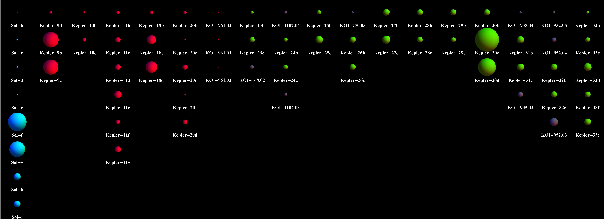

+++
title = "Ttv Confirmation"
date = 2018-12-08T05:09:59-05:00
draft = false

# Tags: can be used for filtering projects.
# Example: `tags = ["machine-learning", "deep-learning"]`
tags = ["kepler","ttv","astrostatistics","graphic","video"]

# Project summary to display on homepage.
summary = ""

# Slides (optional).
#   Associate this page with Markdown slides.
#   Simply enter your slide deck's filename without extension.
#   E.g. `slides = "example-slides"` references 
#   `content/slides/example-slides.md`.
#   Otherwise, set `slides = ""`.
slides = ""

# Optional external URL for project (replaces project detail page).
external_link = ""

# Links (optional).
url_pdf = ""
url_code = ""
url_dataset = ""
url_slides = ""
url_video = ""
url_poster = ""

# Custom links (optional).
#   Uncomment line below to enable. For multiple links, use the form `[{...}, {...}, {...}]`.
# url_custom = [{icon_pack = "fab", icon="twitter", name="Follow", url = "https://twitter.com"}]

# Featured image
# To use, add an image named `featured.jpg/png` to your page's folder. 
[image]
  # Caption (optional)
  caption = ""

  # Focal point (optional)
  # Options: Smart, Center, TopLeft, Top, TopRight, Left, Right, BottomLeft, Bottom, BottomRight
  focal_point = ""
+++

<iframe width="560" height="315" src="https://www.youtube.com/embed/Zdoh1IsSJFk?rel=0" frameborder="0" allowfullscreen></iframe>
## Confirming Planets using Transit Timing Variations
This animation shows the how planet transit times differ depending on whether the system contains one planet or multiple planets.  
(Credit: NASA Ames Research Center/Kepler Mission)

---

<iframe width="560" height="315" src="https://www.youtube.com/embed/65AcjP2fIXg?rel=0" frameborder="0" allowfullscreen></iframe>
## Kepler's Planetary Systems in Motion
This animation shows the orbital position of the planets 
in systems with multiple transiting planets discovered by NASA's 
Kepler mission (as of January 2012).  All the colored planets have been verified.  More 
vivid colors indicate planets that have been confirmed by their 
gravitational interactions. Several of these systems contain 
additional planet candidates (shown in grey) that have not yet been 
verified.  (Credit: Dan Fabrycky, UC Santa Cruz)

---

## Planets in Systems from NASA's Kepler Mission
The image above depicts multiple planet systems discovered 
by NASA's Kepler mission and confirmed by transit timing variations (as of January 2012). 
Out of hundreds of candidate planetary 
systems, scientists had previously verified six systems with multiple 
transiting planets (denoted here in red).  Now, Kepler observations 
have verified planets (shown here in green) in 11 new planetary 
systems.  Many of these systems contain additional planet candidates 
that are yet to be verified (shown here in dark purple). For 
reference, the eight planets of the solar system are shown in blue.  
(Credit: Jason Steffen, Fermilab Center for Particle Astrophysics)

